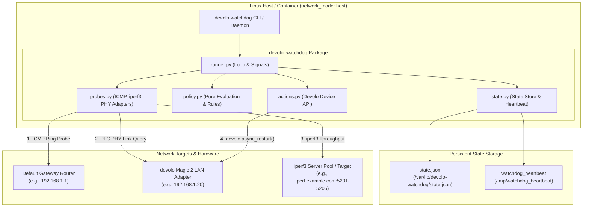
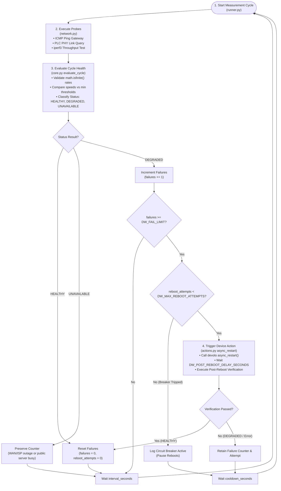
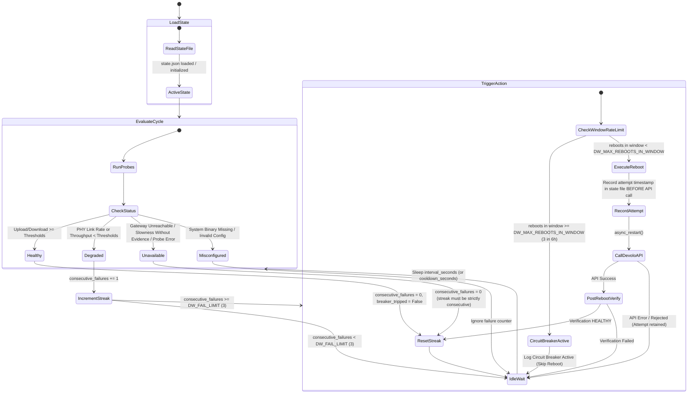

# Watchdog devolo Magic 2 LAN via iperf3 Control

The watchdog runs on a Linux host connected behind a PLC (PowerLine Communication) link and measures upload/download throughput using iperf3 endpoints (`DW_IPERF_SERVER`, which can be local or remote). After several consecutive degradation failures backed by PLC-specific evidence, it can automatically reboot the nearest devolo adapter via its management API.

State transitions and circuit-breaker status are persisted atomically to a JSON state file (`/var/lib/devolo-watchdog/state.json`), preventing counter resets on container or daemon restarts.

---

## System Architecture & Component Topology



---

## Measurement Cycle Algorithm




---

## State Machine & Moving-Window Circuit Breaker



---

## Features & Mechanics

- **Strict Evidence Requirement**: Throughput slowness alone will not trigger a reboot unless confirmed by low devolo PLC PHY link speeds (`DW_REQUIRE_PLC_EVIDENCE_FOR_REBOOT=true`).
- **Moving Window Rate Limiting**: Enforces max reboot limits over a moving time window (default 3 reboots in 6 hours).
- **Pre-Attempt Action Accounting**: Records reboot attempt timestamps in state *before* issuing management API calls, preventing infinite retry loops on rejected requests or exceptions.
- **Safe `--once` Execution**: One-shot CLI execution defaults to dry-run mode. Hardware reboot actions require explicit `--allow-action`.
- **Atomic State Persistence**: State is saved to `/var/lib/devolo-watchdog/state.json` via temporary file writing and atomic file replacement (`os.replace`).
- **Container Heartbeat & Healthcheck**: Updates `/tmp/watchdog_heartbeat` on every cycle, verified by `devolo-watchdog healthcheck`.
- **Diagnostic Tooling**: Subcommands for `doctor` (system diagnostics), `discover` (PLC topology & speeds), `calibrate` (baseline speed measurements & threshold recommendations), and `run`.

---

## PLC Evidence Requirement & PHY Rate Diagnostics (`DW_REQUIRE_PLC_EVIDENCE_FOR_REBOOT`)

### Motivation: Why Low Throughput Alone Is Not Enough
Measuring end-to-end throughput via `iperf3` tests your entire network path (local host -> devolo PLC adapter -> gateway router -> WAN/Internet -> target iperf3 server). A drop in measured throughput can easily be caused by external factors that have nothing to do with the devolo hardware:
- Internet Service Provider (ISP) WAN congestion, line throttling, or routing degradations.
- CPU saturation or bandwidth limitations on public `iperf3` test servers.
- Wi-Fi channel interference or local LAN contention on upstream access points.

Rebooting the devolo PowerLine adapter during an ISP outage or external server slowdown is ineffective, causes unnecessary local network disconnections (dropping active sessions), and subjects the device to hardware power-cycling wear. A reboot should **only** occur when there is explicit proof that the local PowerLine hardware link itself has degraded.

### Why PLC PHY Rates Are a Reliable Measure
Devolo Magic 2 LAN adapters rely on HomePlug AV2 / G.hn modems communicating over household electrical wiring. The devolo device management firmware continuously monitors the raw Physical Layer (PHY) transmission rates (in Mbit/s) between paired PowerLine adapters and exposes this telemetry via `devolo_plc_api`.

- **Direct Hardware Link Telemetry**: PHY transmission rates measure signal strength, signal-to-noise ratio, and electrical noise across mains wiring. They reflect the actual physical health of the PowerLine bridge.
- **Definitive Fault Isolation**: 
  - If the devolo PLC PHY link reports strong transmission speeds (e.g. RX and TX >= `DW_MIN_PLC_PHY_RATE_MBPS`, such as 200+ Mbps) but `iperf3` throughput is low, the watchdog confirms the PowerLine bridge is functioning normally and the bottleneck lies upstream in the WAN/ISP path. The reboot is suppressed.
  - If the devolo PLC PHY rate drops below `DW_MIN_PLC_PHY_RATE_MBPS` (default: 50.0 Mbps), the local PowerLine link is confirmed degraded, providing definitive hardware evidence to schedule a device reboot.

### Policy Rules & Evaluation Matrix

| WAN / iperf3 Throughput | PLC PHY Link Rate | `DW_REQUIRE_PLC_EVIDENCE_FOR_REBOOT` | Evaluation Status | Decision & Action |
| --- | --- | --- | --- | --- |
| **Normal** (>= Min Upload & Download) | **Healthy** (>= `DW_MIN_PLC_PHY_RATE_MBPS`) | `true` or `false` | `healthy` | Failure counter reset to 0 |
| **Low** (< Min Upload or Download) | **Degraded** (< `DW_MIN_PLC_PHY_RATE_MBPS`) | `true` or `false` | `degraded` | Failure counter incremented toward reboot |
| **Low** (< Min Upload or Download) | **Healthy** (>= `DW_MIN_PLC_PHY_RATE_MBPS`) | `true` or `false` | `measurement-unavailable` | Counter reset to 0 (Reboot suppressed: WAN/ISP issue) |
| **Low** (< Min Upload or Download) | **Unqueried / Unavailable** | `true` (Default) | `measurement-unavailable` | Counter reset to 0 (Reboot suppressed: missing proof) |
| **Low** (< Min Upload or Download) | **Unqueried / Unavailable** | `false` | `degraded` | Failure counter incremented toward reboot |

---

## Quick Start via Docker Compose (Recommended)

### 1. Environment Setup

Copy example environment configuration:

```bash
cp devolo-throughput-watchdog.env.example devolo-throughput-watchdog.env
```

Edit `devolo-throughput-watchdog.env`:

```ini
DW_IPERF_SERVER=iperf.example.com
DW_REMOTE_PROBE=192.168.1.1
DW_DEVOLO_IP=192.168.1.20
DW_MIN_UPLOAD_MBPS=100
DW_MIN_DOWNLOAD_MBPS=100
DW_ACTION=log
```

### 2. Run Diagnostics

```bash
docker compose run --rm devolo-watchdog doctor
```

### 3. Start Watchdog Daemon Service

```bash
docker compose up -d
docker compose logs -f
```

---

## CLI Command Reference

### Diagnostics (`doctor`)
Runs a comprehensive environment check (Python version, binaries, DNS, password readability, gateway reachability, devolo IP reachability, and management API access):

```bash
uv run devolo-watchdog doctor
# Or formatted as JSON
uv run devolo-watchdog --json doctor
# Or passing --json before command
uv run devolo-watchdog doctor --json
```

### Discovery (`discover`)
Queries devolo device hardware details, serial number, connected nodes, and PHY speeds:

```bash
uv run devolo-watchdog discover
```

### Threshold Calibration (`calibrate`)
Runs no-action measurements and recommends upload/download minimum thresholds:

```bash
uv run devolo-watchdog calibrate --samples 5
```

### Daemon / Single Check (`run`)

```bash
# Single check (dry-run mode)
uv run devolo-watchdog run --once

# Single check with reboot action allowed
uv run devolo-watchdog run --once --allow-action

# Daemon mode
uv run devolo-watchdog run
```

---

## Development & Test Commands

```bash
# Run linter and formatting checks
uv run lint
# Or: uv run dev-lint

# Auto-format and fix code issues
uv run reformat
# Or: uv run dev-reformat

# Run unit test suite
uv run test
# Or: uv run dev-test

# Run full lint + test check
uv run check
# Or: uv run dev-check
```

---

## Decision Matrix

| Observation | Status Result | Counter / State Effect |
| --- | --- | --- |
| Upload and download above thresholds | `healthy` | Failure counter reset to 0 |
| PLC PHY rate degraded | `degraded` | Failure counter incremented |
| Throughput low, but local PLC link verified healthy | `measurement-unavailable` | Failure counter reset to 0 |
| Throughput low, but no PLC evidence configured | `measurement-unavailable` | Failure counter reset to 0 |
| Local gateway or iperf probe unreachable | `measurement-unavailable` | Failure counter reset to 0 |
| System binary missing / invalid config | `misconfigured` | Counter untouched |
| Max reboot attempts reached in window | `circuit-breaker` | Reboot skipped, circuit breaker active |

---

## Configuration Reference

| Variable | Default | Description |
| --- | --- | --- |
| `DW_IPERF_SERVER` | `iperf.example.com` | iperf3 server hostname (local or remote) |
| `DW_IPERF_PORTS` | `5201-5205` | Range/list of iperf3 candidate ports |
| `DW_REMOTE_PROBE` | *Required* | Local default gateway IP address |
| `DW_DEVOLO_IP` | *Required* | Devolo adapter IP address |
| `DW_MIN_UPLOAD_MBPS` | *Required* | Minimum acceptable upload speed |
| `DW_MIN_DOWNLOAD_MBPS` | *Required* | Minimum acceptable download speed |
| `DW_ACTION` | `log` | Action mode: `log` or `reboot` |
| `DW_FAIL_LIMIT` | `3` | Consecutive degraded cycles before triggering action |
| `DW_REQUIRE_PLC_EVIDENCE_FOR_REBOOT` | `true` | Require PLC PHY evidence before reboot |
| `DW_MIN_PLC_PHY_RATE_MBPS` | `50.0` | Minimum acceptable devolo PLC PHY RX/TX link rate |
| `DW_MAX_REBOOT_ATTEMPTS` | `3` | Legacy max consecutive reboot attempts setting |
| `DW_MAX_REBOOTS_IN_WINDOW` | `3` | Max reboots allowed within moving window |
| `DW_REBOOT_WINDOW_HOURS` | `6.0` | Time window hours for circuit breaker rate limiting |
| `DW_POST_REBOOT_DELAY_SECONDS` | `45` | Post-reboot delay before health verification |
| `DW_STATE_FILE` | `/var/lib/devolo-watchdog/state.json` | Persistent state JSON path |
| `DW_HEARTBEAT_FILE` | `/tmp/watchdog_heartbeat` | Healthcheck heartbeat file path |
| `DW_LOG_FORMAT` | `text` | Structured log output format: `text` or `json` |
