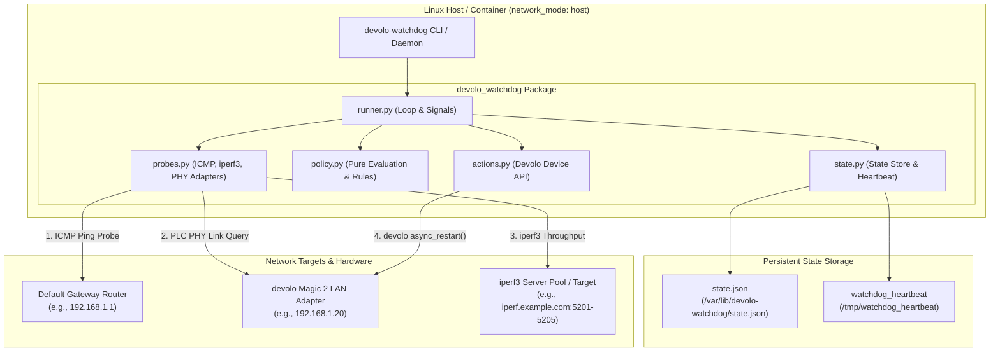
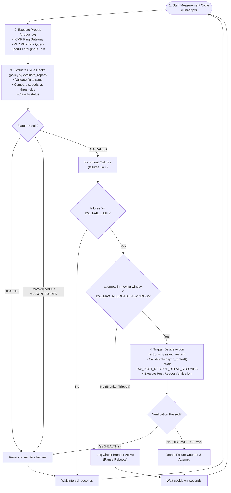
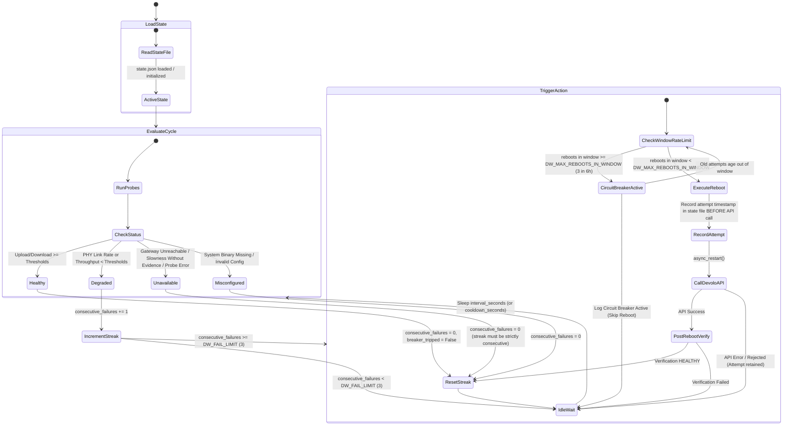

# devolo Throughput Watchdog

The watchdog runs on a Linux host connected behind a PLC (PowerLine Communication) link and measures upload/download
throughput using iperf3 endpoints (`DW_IPERF_SERVER`, which can be local or remote). After several consecutive
degradation failures backed by PLC-specific evidence, it can automatically reboot the nearest devolo adapter via its
management API.

State transitions and circuit-breaker status can be persisted atomically to a JSON state file
(`/var/lib/devolo-watchdog/state.json` in the supplied Compose setup), preventing counter resets on container or daemon
restarts.

This is an independent community project and is not affiliated with or endorsed by devolo Solutions GmbH.

---

## System Architecture & Component Topology



---

## Measurement Cycle Algorithm



---

## State Machine & Moving-Window Circuit Breaker



---

## Features & Mechanics

- **Strict Evidence Requirement**: Throughput slowness alone will not trigger a reboot unless confirmed by low devolo
  PLC PHY link speeds (`DW_REQUIRE_PLC_EVIDENCE_FOR_REBOOT=true`).
- **Moving Window Rate Limiting**: Enforces max reboot attempts over a moving time window (default 3 attempts in 6
  hours) and automatically re-arms when old attempts leave the window.
- **Pre-Attempt Action Accounting**: Records reboot attempt timestamps in state *before* issuing management API calls.
  If a configured state file cannot be written, the reboot is skipped rather than bypassing the rate limit.
- **Safe `--once` Execution**: One-shot CLI execution defaults to dry-run mode. Hardware reboot actions require explicit
  `--allow-action`.
- **On-Demand Restart Test**: The `restart` command exercises the same persisted management-API action path used by
  automated recovery, independently of throughput policy and `DW_ACTION`.
- **Atomic State Persistence**: State is saved to `/var/lib/devolo-watchdog/state.json` via temporary file writing and
  atomic file replacement (`os.replace`).
- **Container Heartbeat & Healthcheck**: Updates `/tmp/watchdog_heartbeat` before each cycle. Freshness defaults to
  twice the configured cycle interval (minimum 90 seconds), so the default 10-minute interval remains healthy.
- **Diagnostic Tooling**: Subcommands for `doctor` (system diagnostics), `discover` (PLC topology & speeds), `restart`
  (explicit hardware action test), `calibrate` (baseline speed measurements & threshold recommendations), and `run`.

---

## PLC Evidence Requirement & PHY Rate Diagnostics (`DW_REQUIRE_PLC_EVIDENCE_FOR_REBOOT`)

### Motivation: Why Low Throughput Alone Is Not Enough

Measuring end-to-end throughput via `iperf3` tests your entire network path (local host -> devolo PLC adapter -> gateway
router -> WAN/Internet -> target iperf3 server). A drop in measured throughput can easily be caused by external factors
that have nothing to do with the devolo hardware:

- Internet Service Provider (ISP) WAN congestion, line throttling, or routing degradations.
- CPU saturation or bandwidth limitations on public `iperf3` test servers.
- Wi-Fi channel interference or local LAN contention on upstream access points.

Rebooting the devolo PowerLine adapter during an ISP outage or external server slowdown is ineffective, causes
unnecessary local network disconnections (dropping active sessions), and subjects the device to hardware power-cycling
wear. A reboot should **only** occur when there is explicit proof that the local PowerLine hardware link itself has
degraded.

### Why PLC PHY Rates Are Useful Diagnostic Evidence

Devolo Magic adapters communicate over household electrical wiring. Their management interface reports Physical Layer
(PHY) transmission rates (in Mbit/s) between paired PowerLine adapters through `devolo_plc_api`.

- **Local Link Telemetry**: PHY transmission rates reflect conditions on the PowerLine link and help distinguish a local
  PLC problem from an upstream WAN or iperf-server problem. They are diagnostic evidence, not a guarantee of application
  throughput.
- **Targeted Topology Evidence**: When the API supplies link endpoint MAC addresses, only rates involving the configured
  adapter are evaluated. On firmware that omits those endpoints, the watchdog conservatively falls back to the minimum
  rate reported in the topology.
- **Fault Isolation**:
  - If the devolo PLC PHY link reports strong transmission speeds (e.g. RX and TX >= `DW_MIN_PLC_PHY_RATE_MBPS`, such as
    200+ Mbps) but `iperf3` throughput is low, the watchdog confirms the PowerLine bridge is functioning normally and
    the bottleneck lies upstream in the WAN/ISP path. The reboot is suppressed.
  - If the devolo PLC PHY rate drops below `DW_MIN_PLC_PHY_RATE_MBPS` (default: 50.0 Mbps), the local PowerLine link is
    treated as degraded evidence for the reboot policy.

### Policy Rules & Evaluation Matrix

| WAN / iperf3 Throughput               | PLC PHY Link Rate                           | `DW_REQUIRE_PLC_EVIDENCE_FOR_REBOOT` | Evaluation Status         | Decision & Action                                     |
|---------------------------------------|---------------------------------------------|--------------------------------------|---------------------------|-------------------------------------------------------|
| **Normal** (>= Min Upload & Download) | **Healthy** (>= `DW_MIN_PLC_PHY_RATE_MBPS`) | `true` or `false`                    | `healthy`                 | Failure counter reset to 0                            |
| **Any / not run**                     | **Degraded** (< `DW_MIN_PLC_PHY_RATE_MBPS`) | `true` or `false`                    | `degraded`                | Failure counter incremented toward reboot             |
| **Low** (< Min Upload or Download)    | **Healthy** (>= `DW_MIN_PLC_PHY_RATE_MBPS`) | `true` or `false`                    | `measurement-unavailable` | Counter reset to 0 (Reboot suppressed: WAN/ISP issue) |
| **Low** (< Min Upload or Download)    | **Unqueried / Unavailable**                 | `true` (Default)                     | `measurement-unavailable` | Counter reset to 0 (Reboot suppressed: missing proof) |
| **Low** (< Min Upload or Download)    | **Unqueried / Unavailable**                 | `false`                              | `degraded`                | Failure counter incremented toward reboot             |

---

## Quick Start via Docker Compose (Recommended)

Requirements: Linux, Docker Engine with the Compose plugin, LAN access to the gateway and adapter, and a reachable
iperf3 server. Host networking is required for local discovery and is a Linux-specific deployment choice.

Start with `DW_ACTION=log`. A reboot interrupts traffic through the adapter, so enable `reboot` only after `doctor`,
`discover`, and calibration produce sensible results.

### Pre-built Container Images

CI publishes multi-platform images for `linux/amd64` and `linux/arm64` to the
[GitHub Container Registry](https://github.com/valentinsviridov/devolo-throughput-watchdog/pkgs/container/devolo-throughput-watchdog):

```text
ghcr.io/valentinsviridov/devolo-throughput-watchdog:latest
```

Pull the current default-branch image with:

```bash
docker pull ghcr.io/valentinsviridov/devolo-throughput-watchdog:latest
```

Public GHCR packages can be pulled anonymously. If package access is restricted, authenticate to `ghcr.io` with a
token carrying `read:packages` before pulling.

Commit-specific images are also published as `sha-<short-commit>`. The supplied `compose.yml` builds from the local
source by default. To use the registry image instead, replace `build: .` in that file with:

```yaml
image: ghcr.io/valentinsviridov/devolo-throughput-watchdog:latest
```

### 1. Environment Setup

Copy example environment configuration:

```bash
cp devolo-throughput-watchdog.env.example devolo-throughput-watchdog.env
```

Edit `devolo-throughput-watchdog.env`:

```ini
DW_IPERF_SERVER=iperf.example.com
DW_REMOTE_PROBE=192.168.1.1
DW_DEVOLO_IP=192.168.1.20
DW_MIN_UPLOAD_MBPS=100
DW_MIN_DOWNLOAD_MBPS=100
DW_ACTION=log
```

### 2. Run Diagnostics

```bash
docker compose run --rm devolo-watchdog doctor
```

### 3. Start Watchdog Daemon Service

```bash
docker compose up -d
docker compose logs -f
```

---

## CLI Command Reference

### Diagnostics (`doctor`)

Runs environment checks for Python, required binaries, configuration, password readability, state-directory writability,
gateway/device reachability, and management API access:

```bash
uv run devolo-watchdog doctor
# Or formatted as JSON
uv run devolo-watchdog --json doctor
# Or passing --json before command
uv run devolo-watchdog doctor --json
```

### Discovery (`discover`)

Queries devolo device hardware details, serial number, connected nodes, and PHY speeds:

```bash
uv run devolo-watchdog discover
```

### Threshold Calibration (`calibrate`)

Runs no-action measurements and recommends upload/download minimum thresholds:

```bash
uv run devolo-watchdog calibrate --samples 5
# JSON is emitted only on stdout; progress remains on stderr.
uv run devolo-watchdog --json calibrate --samples 5
```

### On-Demand Device Restart (`restart`)

Immediately sends a restart request to `DW_DEVOLO_IP` through the same state-accounted management API path used by
automated recovery:

```bash
uv run devolo-watchdog restart
# Machine-readable result
uv run devolo-watchdog --json restart
```

Running this command is explicit authorization to interrupt traffic through the configured adapter. It deliberately
bypasses throughput checks, `DW_ACTION`, failure thresholds, and the circuit-breaker decision so an operator can test
the hardware integration. The attempt is still recorded before the API call and counts toward the moving-window history
when `DW_STATE_FILE` is configured. If that configured state cannot be written, the restart is skipped.

An `accepted` result means the device management API accepted the same restart request automation uses; it does not mean
the device has completed rebooting or passed a post-restart throughput check. Run `doctor` first, and avoid issuing the
command while users depend on the PLC link.

For the supplied Compose deployment, stop the daemon first to avoid concurrent state updates, run the one-off command
against the same configuration and state volume, then start it again:

```bash
docker compose stop devolo-watchdog
docker compose run --rm devolo-watchdog restart
docker compose up -d
```

### Daemon / Single Check (`run`)

```bash
# Single check (dry-run mode)
uv run devolo-watchdog run --once

# Single check with reboot action allowed
uv run devolo-watchdog run --once --allow-action

# Daemon mode
uv run devolo-watchdog run

# Structured one-line JSON cycle records
uv run devolo-watchdog --json run
```

---

## Native Installation

The daemon requires Linux `ping` and `iperf3`, Python 3.11 or newer, and LAN access to the target devices.
With [uv](https://docs.astral.sh/uv/) installed:

```bash
uv sync --locked
cp devolo-throughput-watchdog.env.example devolo-throughput-watchdog.env
uv run devolo-watchdog doctor
uv run devolo-watchdog run --once
```

The CLI loads `devolo-throughput-watchdog.env` (or `.env`) from its current working directory without replacing
variables already present in the process environment.

### Exit Codes

| Command/result                                                            | Exit code |
|---------------------------------------------------------------------------|-----------|
| Healthy check, successful diagnostic, or accepted restart request         | `0`       |
| Degraded check, failed calibration, stale heartbeat, or rejected restart  | `1`       |
| Measurement unavailable, discovery/reachability failure, or restart error | `2`       |
| Invalid configuration or missing runtime dependency                       | `3`       |

---

## Development & Test Commands

See [CONTRIBUTING.md](CONTRIBUTING.md) for module ownership, safety invariants, and the change checklist.

```bash
# Run linter and formatting checks
uv run dev-lint

# Auto-format and fix code issues
uv run dev-reformat

# Run the test suite with branch coverage (minimum 80%)
uv run dev-test

# Run the same full check used by CI
uv run dev-check

# Build wheel and source distribution
uv build

# Run the full local verification checklist, including the Docker build
./scripts/verify.sh
```

Use `./scripts/verify.sh --skip-docker` for the faster application-only checks. Add
`--keep-artifacts` to copy the freshly verified wheel and source archive into `dist/`; otherwise, package artifacts are
built in a temporary directory and removed afterward.

---

## Decision Matrix

| Observation                                         | Status Result             | Counter / State Effect                                         |
|-----------------------------------------------------|---------------------------|----------------------------------------------------------------|
| Upload and download above thresholds                | `healthy`                 | Failure counter reset to 0                                     |
| PLC PHY rate degraded                               | `degraded`                | Failure counter incremented                                    |
| Throughput low, but local PLC link verified healthy | `measurement-unavailable` | Failure counter reset to 0                                     |
| Throughput low, but no PLC evidence configured      | `measurement-unavailable` | Failure counter reset to 0                                     |
| Local gateway or iperf probe unreachable            | `measurement-unavailable` | Failure counter reset to 0                                     |
| System binary missing / invalid config              | `misconfigured`           | Failure counter reset to 0                                     |
| Max reboot attempts reached in window               | `degraded`                | Reboot skipped; breaker automatically re-arms after the window |

---

## Configuration Reference

| Variable                             | Default                 | Description                                                                    |
|--------------------------------------|-------------------------|--------------------------------------------------------------------------------|
| `DW_IPERF_SERVER`                    | `iperf.example.com`     | iperf3 server hostname (local or remote)                                       |
| `DW_IPERF_PORTS`                     | `5201-5205`             | Range/list of iperf3 candidate ports                                           |
| `DW_IPERF_TRIES`                     | `5`                     | Candidate ports tried in each direction; cannot exceed configured port count   |
| `DW_IPERF_TIMEOUT_SECONDS`           | `30`                    | Maximum time for each fixed-size transfer                                      |
| `DW_IPERF_CONNECT_TIMEOUT_MS`        | `3000`                  | iperf3 connection timeout per candidate port                                   |
| `DW_REMOTE_PROBE`                    | *Required*              | Local default gateway IP address                                               |
| `DW_DEVOLO_IP`                       | *Required*              | Devolo adapter IP address                                                      |
| `DW_MIN_UPLOAD_MBPS`                 | *Required*              | Minimum acceptable upload speed                                                |
| `DW_MIN_DOWNLOAD_MBPS`               | *Required*              | Minimum acceptable download speed                                              |
| `DW_TEST_BYTES`                      | `64M`                   | Bytes transferred by each directional test                                     |
| `DW_PARALLEL_STREAMS`                | `1`                     | Parallel iperf3 streams                                                        |
| `DW_INTERVAL_SECONDS`                | `600`                   | Target time between cycle starts                                               |
| `DW_ACTION`                          | `log`                   | Action mode: `log` or `reboot`                                                 |
| `DW_FAIL_LIMIT`                      | `3`                     | Consecutive degraded cycles before triggering action                           |
| `DW_COOLDOWN_SECONDS`                | `600`                   | Target time before the next cycle after a reboot decision                      |
| `DW_INITIAL_DELAY_SECONDS`           | `30`                    | Startup delay in daemon mode                                                   |
| `DW_PING_COUNT`                      | `2`                     | Packets sent by each gateway/device ping check                                 |
| `DW_PING_TIMEOUT_SECONDS`            | `2`                     | Per-packet ping wait time                                                      |
| `DW_PASSWORD_FILE`                   | unset                   | File containing the devolo management password                                 |
| `DW_REQUIRE_PLC_EVIDENCE_FOR_REBOOT` | `true`                  | Require PLC PHY evidence before reboot                                         |
| `DW_MIN_PLC_PHY_RATE_MBPS`           | `50.0`                  | Minimum acceptable devolo PLC PHY RX/TX link rate                              |
| `DW_MAX_REBOOTS_IN_WINDOW`           | `3`                     | Max API attempts allowed within the moving window                              |
| `DW_REBOOT_WINDOW_HOURS`             | `6.0`                   | Time window hours for circuit breaker rate limiting                            |
| `DW_POST_REBOOT_DELAY_SECONDS`       | `45`                    | Post-reboot delay before health verification                                   |
| `DW_STATE_FILE`                      | unset                   | Persistent state JSON path; Compose sets `/var/lib/devolo-watchdog/state.json` |
| `DW_HEARTBEAT_FILE`                  | unset                   | Heartbeat JSON path; Compose sets `/tmp/watchdog_heartbeat`                    |
| `DW_HEARTBEAT_MAX_AGE_SECONDS`       | `max(90, 2 × interval)` | Optional healthcheck freshness override                                        |
| `DW_LOG_FORMAT`                      | `text`                  | Structured log output format: `text` or `json`                                 |

## License

This project is licensed under the **GNU General Public License v3.0 or later (GPL-3.0-or-later)**. This copyleft choice
is consistent with the `devolo-plc-api` dependency, which uses the same license expression. See [LICENSE](LICENSE) for
the complete terms.
