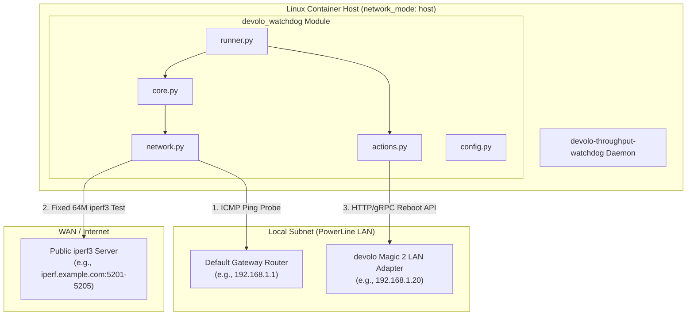
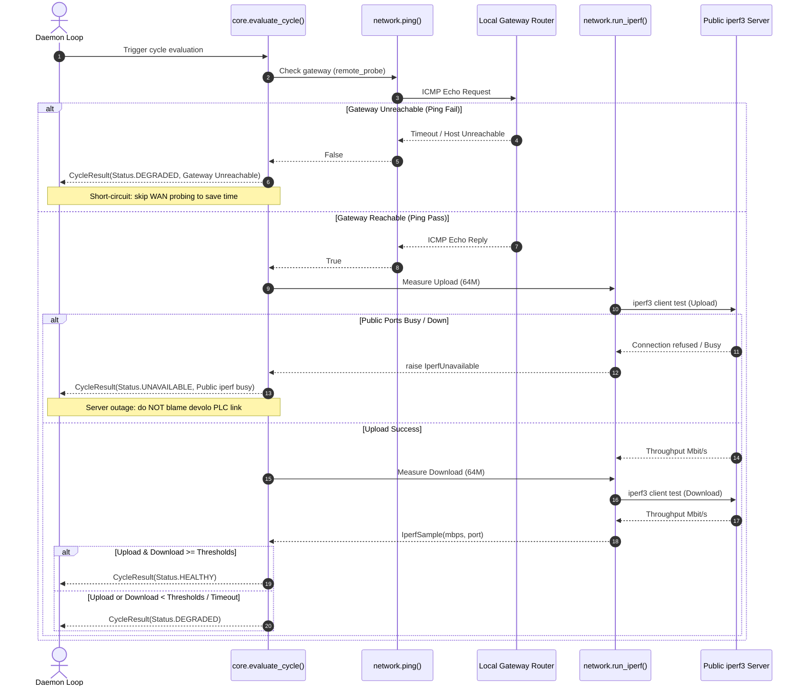
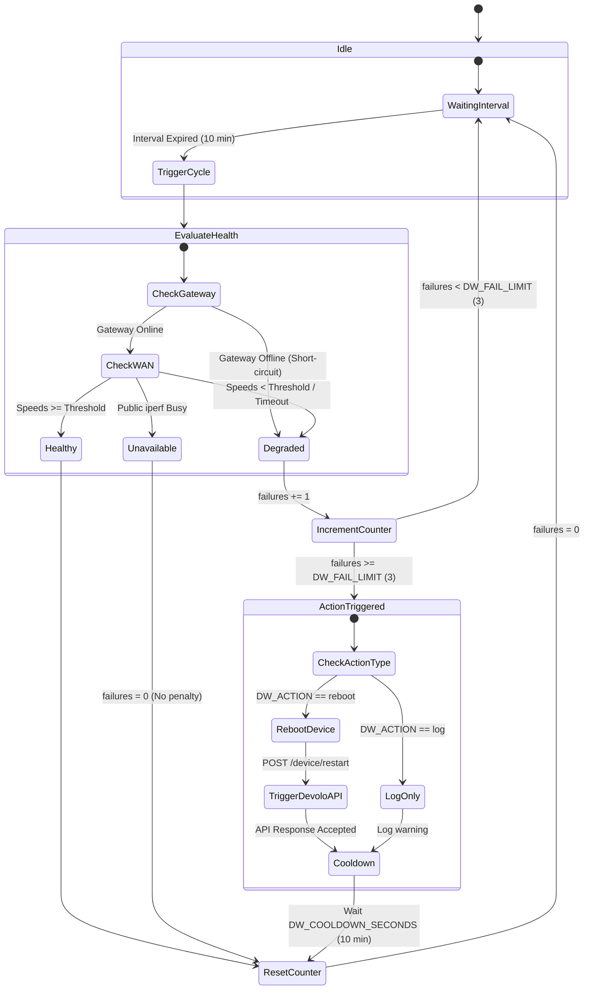

# Watchdog devolo Magic 2 LAN via Public iperf3

The watchdog runs on a Linux host connected behind a PLC (PowerLine Communication) link and measures upload/download throughput using a public iperf3 server. After several consecutive degradation failures, it can automatically reboot the nearest devolo adapter via its management API.

This is an end-to-end measurement: the result includes the PLC link, local gateway router, and access network. While it cannot distinguish a PLC issue from an ISP network failure with 100% precision, it provides an effective automated recovery mechanism for observed user throughput degradation.

---

## System Architecture & Flow

### Component Topology



---

### Measurement Cycle Algorithm



---

### Daemon Health State Machine



---

## Features & Mechanics

- Uses configurable public iperf3 ports (e.g. `5201–5205`).
- When encountering `server busy`, the watchdog retries up to five adjacent ports.
- Port rotation: the initial port shifts between measurement cycles, and upload/download start on different ports.
- Transfers a fixed volume of data (`64M` default) in each direction instead of a fixed duration test.
- If public iperf ports are unavailable but the local gateway responds to ping, the event is categorized as a measurement infrastructure issue and does **not** trigger a reboot.
- If a `64M` transfer does not complete within 30 seconds, the test is marked as degraded.

---

## Quick Start via Docker & Docker Compose (Recommended)

Ensure Docker and Docker Compose are installed on your host system.

### 1. Configuration Setup

Copy the example environment file:

```bash
cp devolo-throughput-watchdog.env.example devolo-throughput-watchdog.env
```

Find your local default gateway IP address:

```bash
ip route show default
```

Edit `devolo-throughput-watchdog.env`:

```ini
DW_IPERF_SERVER=iperf.example.com
DW_REMOTE_PROBE=192.168.1.1
DW_DEVOLO_IP=192.168.1.20
DW_MIN_UPLOAD_MBPS=100
DW_MIN_DOWNLOAD_MBPS=100
DW_ACTION=log
```

If the devolo web interface is password-protected, set `DW_PASSWORD_FILE` or mount your password file into the container.

### 2. Validate Configuration & Run One-Shot Test

```bash
# Validate environment configuration inside container
docker compose run --rm devolo-watchdog --check-config

# Run a single measurement cycle
docker compose run --rm devolo-watchdog --once
```

### 3. Start Daemon Service

```bash
docker compose up -d
```

View live logs:

```bash
docker compose logs -f
```

> **Important**: The container runs with `network_mode: host` so `iperf3` and `ping` measure throughput directly on host network interfaces and access devolo adapters on the local subnet.

---

## Local Execution via `uv` (Without Docker)

The project uses [uv](https://github.com/astral-sh/uv) as its Python package manager.

```bash
# Validate configuration (uv automatically syncs environment)
uv run devolo-watchdog --check-config

# Single test run
uv run devolo-watchdog --once

# Run daemon mode
uv run devolo-watchdog
```

---

## Development Tasks (Tests & Linter)

Development tasks are defined directly as native script entrypoints in `pyproject.toml` and executed with `uv`:

```bash
# Run full unit test suite
uv run test

# Check code style and lints (Ruff)
uv run lint

# Run both linter and unit tests
uv run check
```

---

## Manual iperf3 Verification

```bash
iperf3 -c iperf.example.com -p 5201 -n 64M
iperf3 -c iperf.example.com -p 5202 -R -n 64M
```

`server is busy` responses are expected on public servers — retry using another port within configured ranges.

---

## Calibration & Action Mode

1. Keep `DW_ACTION=log` initially in `devolo-throughput-watchdog.env`.
2. Collect logs for at least 24 hours. Log output format:

```text
status=healthy failures=0/3 upload=321.4Mbps@5201 download=287.8Mbps@5202
status=degraded failures=1/3 upload=18.2Mbps@5201 download=14.7Mbps@5202
```

3. Set threshold levels significantly below typical speeds (e.g. 30–50% of normal value).
4. Once verified, enable automatic reboot by setting `DW_ACTION=reboot` and restarting:

```bash
docker compose restart
```

---

## Network Traffic Usage

Each normal cycle transfers approximately `64M + 64M = 128M`. At an interval of 10 minutes, maximum daily traffic is around 18.4 GB. To reduce data usage:

```ini
DW_TEST_BYTES=32M
DW_INTERVAL_SECONDS=900
```

*Note: Smaller test sizes decrease high-speed accuracy due to TCP slow start. Avoid setting below `16M`.*

---

## Decision Matrix

| Observation | Status Result | Counter Effect |
| --- | --- | --- |
| Upload and download above thresholds | `healthy` | Failure counter reset to 0 |
| Either direction below threshold | `degraded` | Failure counter incremented |
| Transfer did not finish within timeout | `degraded` | Failure counter incremented |
| Public ports unreachable, local gateway responds | `measurement-unavailable` | Ignored (counter reset) |
| Both public ports and local gateway unreachable | `degraded` | Failure counter incremented |
