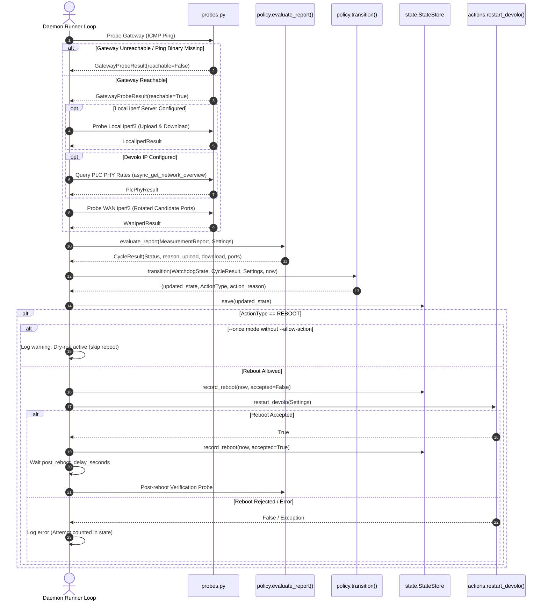

# Watchdog devolo Magic 2 LAN via Public & Local iperf3 Control

The watchdog runs on a Linux host connected behind a PLC (PowerLine Communication) link and measures upload/download throughput using public and/or local iperf3 endpoints. After several consecutive degradation failures backed by PLC-specific evidence, it can automatically reboot the nearest devolo adapter via its management API.

State transitions and circuit-breaker status are persisted atomically to a JSON state file (`/var/lib/devolo-watchdog/state.json`), preventing counter resets on container or daemon restarts.

---

## System Architecture & Component Topology

```mermaid
graph TD
    subgraph Host ["Linux Host / Container (network_mode: host, non-root)"]
        Daemon["devolo-watchdog Daemon / CLI"]
        subgraph Package ["devolo_watchdog Package"]
            Main["__main__.py (CLI Subcommands)"]
            Runner["runner.py (Loop & Signals)"]
            Probes["probes.py (Typed Adapters)"]
            Policy["policy.py (Pure Evaluation & State Transitions)"]
            Models["models.py (Typed Reports & State)"]
            State["state.py (Atomic File Store & Heartbeat)"]
            Actions["actions.py (Devolo Device API)"]
            Config["config.py (Settings & Validation)"]
        end
    end

    subgraph Storage ["Persistent State Volume"]
        StateFile["state.json (/var/lib/devolo-watchdog/state.json)"]
        HeartbeatFile["watchdog_heartbeat (/tmp/watchdog_heartbeat)"]
    end

    subgraph LAN ["Local Subnet (PowerLine Network)"]
        Gateway["Default Gateway Router\n(e.g., 192.168.1.1)"]
        LocalIperf["Optional Local iperf3 Server\n(e.g., 192.168.1.100:5201)"]
        Devolo["devolo Magic 2 LAN Adapter\n(e.g., 192.168.1.20)"]
    end

    subgraph WAN ["Internet / Public Net"]
        PublicIperf["Public iperf3 Servers\n(e.g., iperf.example.com:5201-5205)"]
    end

    Main --> Runner
    Runner --> Probes
    Runner --> Policy
    Runner --> State
    Runner --> Actions
    Policy --> Models
    State --> StateFile
    State --> HeartbeatFile

    Probes -- "1. ICMP Ping Probe" --> Gateway
    Probes -- "2. Local PLC Speed Test" --> LocalIperf
    Probes -- "3. PLC PHY Link Overview" --> Devolo
    Probes -- "4. Public WAN Throughput" --> PublicIperf
    Actions -- "5. devolo async_restart()" --> Devolo
```



---

## Measurement Cycle Algorithm



---

## State Machine & Moving-Window Circuit Breaker


---

## Features & Mechanics

- **Strict Evidence Requirement**: Public WAN slowness alone will not trigger a reboot unless confirmed by local iperf degradation or low devolo PLC PHY link speeds (`DW_REQUIRE_PLC_EVIDENCE_FOR_REBOOT=true`).
- **Moving Window Rate Limiting**: Enforces max reboot limits over a moving time window (default 3 reboots in 6 hours).
- **Pre-Attempt Action Accounting**: Records reboot attempt timestamps in state *before* issuing management API calls, preventing infinite retry loops on rejected requests or exceptions.
- **Safe `--once` Execution**: One-shot CLI execution defaults to dry-run mode. Hardware reboot actions require explicit `--allow-action`.
- **Atomic State Persistence**: State is saved to `/var/lib/devolo-watchdog/state.json` via temporary file writing and atomic file replacement (`os.replace`).
- **Container Heartbeat & Healthcheck**: Updates `/tmp/watchdog_heartbeat` on every cycle, verified by `devolo-watchdog healthcheck`.
- **Diagnostic Tooling**: Subcommands for `doctor` (system diagnostics), `discover` (PLC topology & speeds), `calibrate` (baseline speed measurements & threshold recommendations), and `run`.

---

## Quick Start via Docker Compose (Recommended)

### 1. Environment Setup

Copy example environment configuration:

```bash
cp devolo-throughput-watchdog.env.example devolo-throughput-watchdog.env
```

Edit `devolo-throughput-watchdog.env`:

```ini
DW_IPERF_SERVER=iperf.example.com
DW_REMOTE_PROBE=192.168.1.1
DW_DEVOLO_IP=192.168.1.20
DW_MIN_UPLOAD_MBPS=100
DW_MIN_DOWNLOAD_MBPS=100
DW_ACTION=log
```

### 2. Run Diagnostics

```bash
docker compose run --rm devolo-watchdog doctor
```

### 3. Start Watchdog Daemon Service

```bash
docker compose up -d
docker compose logs -f
```

---

## CLI Command Reference

### Diagnostics (`doctor`)
Runs a comprehensive environment check (Python version, binaries, DNS, password readability, gateway reachability, devolo IP reachability, and management API access):

```bash
uv run devolo-watchdog doctor
# Or formatted as JSON
uv run devolo-watchdog --json doctor
# Or passing --json before command
uv run devolo-watchdog doctor --json
```

### Discovery (`discover`)
Queries devolo device hardware details, serial number, connected nodes, and PHY speeds:

```bash
uv run devolo-watchdog discover
```

### Threshold Calibration (`calibrate`)
Runs no-action measurements and recommends upload/download minimum thresholds:

```bash
uv run devolo-watchdog calibrate --samples 5
```

### Daemon / Single Check (`run`)

```bash
# Single check (dry-run mode)
uv run devolo-watchdog run --once

# Single check with reboot action allowed
uv run devolo-watchdog run --once --allow-action

# Daemon mode
uv run devolo-watchdog run
```

---

## Development & Test Commands

```bash
# Run linter and formatting checks
uv run lint
# Or: uv run dev-lint

# Run unit test suite
uv run test
# Or: uv run dev-test

# Run full lint + test check
uv run check
# Or: uv run dev-check
```

---

## Local iperf3 Control Setup Guide

When using a local control server (`DW_LOCAL_IPERF_SERVER`), note that standard `iperf3` serves one active test connection at a time.

Run `iperf3` in server mode on your default gateway router or local target host:

```bash
iperf3 --server --daemon --port 5201
```

Set watchdog configuration:

```ini
DW_LOCAL_IPERF_SERVER=192.168.1.100
DW_LOCAL_IPERF_PORT=5201
```

---

## Decision Matrix

| Observation | Status Result | Counter / State Effect |
| --- | --- | --- |
| Upload and download above thresholds | `healthy` | Failure counter reset to 0 |
| Local PLC link or PLC PHY rate degraded | `degraded` | Failure counter incremented |
| WAN low, but local PLC link verified healthy | `measurement-unavailable` | Failure counter reset to 0 |
| WAN low, but no local PLC probe configured | `measurement-unavailable` | Failure counter reset to 0 |
| Local gateway or iperf probe unreachable | `measurement-unavailable` | Failure counter reset to 0 |
| System binary missing / invalid config | `misconfigured` | Counter untouched |
| Max reboot attempts reached in window | `circuit-breaker` | Reboot skipped, circuit breaker active |

---

## Configuration Reference

| Variable | Default | Description |
| --- | --- | --- |
| `DW_IPERF_SERVER` | `iperf.example.com` | Public iperf3 server hostname |
| `DW_IPERF_PORTS` | `5201-5205` | Range/list of public iperf3 candidate ports |
| `DW_REMOTE_PROBE` | *Required* | Local default gateway IP address |
| `DW_DEVOLO_IP` | *Required* | Devolo adapter IP address |
| `DW_MIN_UPLOAD_MBPS` | *Required* | Minimum acceptable WAN upload speed |
| `DW_MIN_DOWNLOAD_MBPS` | *Required* | Minimum acceptable WAN download speed |
| `DW_LOCAL_MIN_UPLOAD_MBPS` | `None` | Optional separate local upload threshold |
| `DW_LOCAL_MIN_DOWNLOAD_MBPS` | `None` | Optional separate local download threshold |
| `DW_ACTION` | `log` | Action mode: `log` or `reboot` |
| `DW_FAIL_LIMIT` | `3` | Consecutive degraded cycles before triggering action |
| `DW_LOCAL_IPERF_SERVER` | `None` | Optional local far-side iperf3 server IP |
| `DW_LOCAL_IPERF_PORT` | `5201` | Local iperf3 server port |
| `DW_REQUIRE_PLC_EVIDENCE_FOR_REBOOT` | `true` | Require local probe or PHY evidence before reboot |
| `DW_MIN_PLC_PHY_RATE_MBPS` | `50.0` | Minimum acceptable devolo PLC PHY RX/TX link rate |
| `DW_MAX_REBOOT_ATTEMPTS` | `3` | Legacy max consecutive reboot attempts setting |
| `DW_MAX_REBOOTS_IN_WINDOW` | `3` | Max reboots allowed within moving window |
| `DW_REBOOT_WINDOW_HOURS` | `6.0` | Time window hours for circuit breaker rate limiting |
| `DW_POST_REBOOT_DELAY_SECONDS` | `45` | Post-reboot delay before health verification |
| `DW_STATE_FILE` | `/var/lib/devolo-watchdog/state.json` | Persistent state JSON path |
| `DW_HEARTBEAT_FILE` | `/tmp/watchdog_heartbeat` | Healthcheck heartbeat file path |
| `DW_LOG_FORMAT` | `text` | Structured log output format: `text` or `json` |
